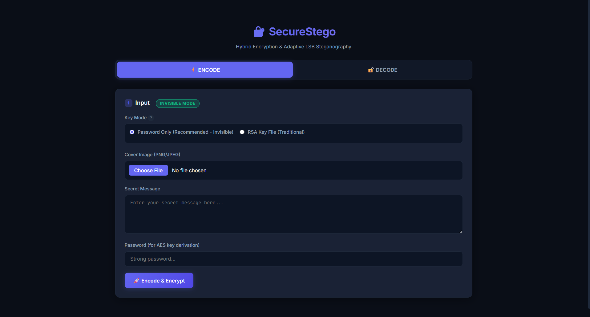
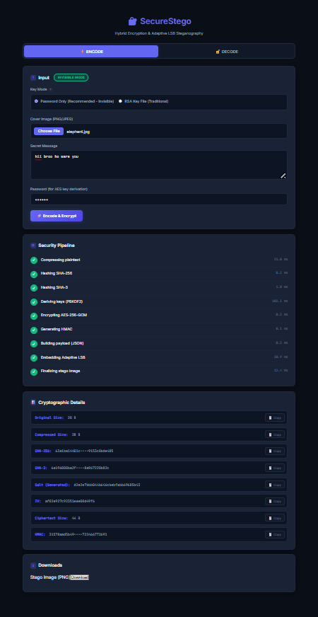
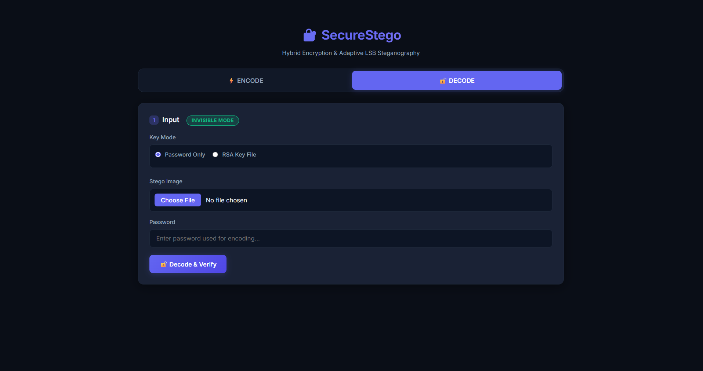
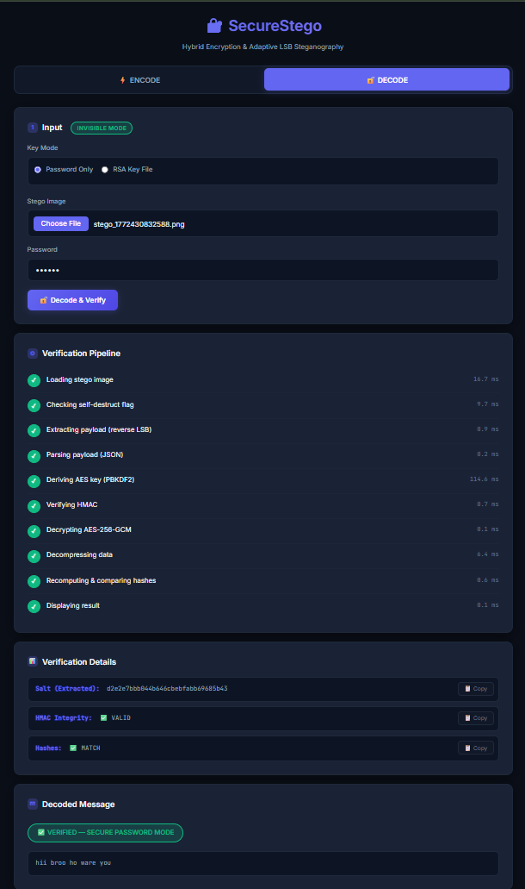

# 🔐 Secure Steganography Web App

A web-based application that hides secret messages inside images using steganography techniques.

## 🌐 Live Demo
https://badamiamarnath.github.io/stego-image/

## 📌 Features
- Hide secret message inside image
- Extract hidden message
- Simple and user-friendly interface
- Fully client-side (No server required)

## 🛠 Technologies Used
- HTML
- CSS
- JavaScript

## 📷 Screenshots
### 🔐 Encode – Normal

### 🔐 Encode – After Running

### 🔓 Decode – Normal

### 🔓 Decode – After Running

---

## 📖 Project Description
This project demonstrates the concept of image steganography where confidential text is hidden inside digital images without visibly altering them.

It is developed as a mini project to understand data security and information hiding techniques.
